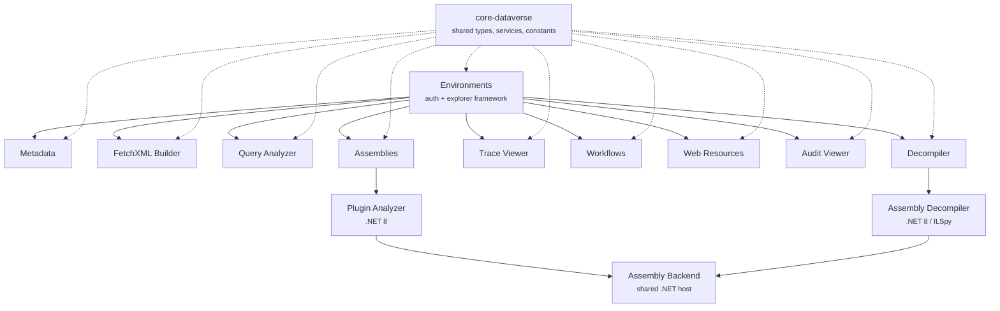

# Dataverse Tools for VS Code

[](https://github.com/guramrit-dhillon/dataverse-tools-vscode/actions/workflows/ci.yml)
[](https://github.com/guramrit-dhillon/dataverse-tools-vscode/actions/workflows/release.yml)
[](LICENSE)

Browse metadata, query data, deploy plugins, manage workflows, edit web resources, debug trace logs, view audit history, and decompile assemblies — all without leaving VS Code.

A modern, code-centric alternative to the XrmToolBox ecosystem for Dynamics 365 and Power Platform developers.

> **Requires:** VS Code 1.96+
> **License:** MIT

---

## Why Dataverse Tools?

Dynamics 365 / Power Platform development has always meant context-switching — maker portal for metadata, XrmToolBox for deployment, browser for queries, separate viewers for traces and audits.

Dataverse Tools brings it all into one place:

- **One explorer for everything** — entities, assemblies, workflows, web resources, and more in a single sidebar, scoped to your active solution
- **Query your way** — build FetchXML visually or write SQL with live autocomplete, both with instant results
- **Deploy from your editor** — one-click plugin deployment after build, with smart hash comparison to skip unchanged assemblies
- **Edit and publish in place** — open web resources as editor tabs, Ctrl+S writes back to Dataverse
- **Switch environments in seconds** — dev, test, and prod all available from the same tree
- **Modular** — install only the extensions you need; each does one thing well

---

## Extensions

Ten extensions share a common foundation. Install them all at once with the [Dataverse Tools](https://marketplace.visualstudio.com/items?itemName=gdhillon.dataverse-tools-pack) extension pack, or pick the ones you need.

| Extension | What it does | Status |
|---|---|---|
| **Environments** | Connect to environments, manage sign-in, and provide the shared explorer sidebar | |
| **Metadata** | Browse entities in the explorer (attributes, relationships, and messages coming soon) | `WIP` |
| **FetchXML Builder** | Visual query builder with execution, results table, and CSV export | |
| **Query Analyzer** | SQL editor for the Dataverse TDS endpoint with live autocomplete | |
| **Assemblies** | Deploy plugin assemblies, register steps, and manage pre/post images | |
| **Trace Viewer** | Search and inspect plugin execution trace logs | |
| **Workflows** | Browse, activate, deactivate, and trigger Dataverse process automation | |
| **Web Resources** | Edit and publish JS, CSS, and HTML resources with Ctrl+S | |
| **Audit Viewer** | View and analyze audit history for Dataverse records | |
| **Decompiler** | Browse decompiled C# source from any deployed plugin assembly | |

### Architecture



All extensions depend on **Environments** for authentication and the explorer framework. **core-dataverse** provides shared types, services, and constants consumed by every package.

---

## Features at a glance

### Environments — Connect and stay signed in

Connect using your Microsoft account, Azure CLI, device code, or a service principal — configured per environment. The extension auto-discovers all the Dataverse orgs in your tenant via Global Discovery, so you don't have to remember URLs. Tokens refresh silently in the background. Switch between environments in one click.

<!--  -->

### Metadata — Browse your environment's schema `WIP`

Browse all entities in your environment with display names alongside logical names — the names you use in plugin code, FetchXML, and SQL queries. Filter by solution or managed/unmanaged state.

Expanding entities to browse attributes, relationships, and SDK messages is under active development.

### FetchXML Builder — Build queries visually

A tree editor where you click to add nodes — entity, attribute, link-entity, filter, condition, order. Entity and attribute pickers are driven by live metadata. Condition operators adapt to the field type. Aggregate queries, relationship joins, and formatted result values (option set labels, currency symbols, lookup names) are all supported. Edit the raw XML directly when you need to — changes sync back to the tree. Built-in CSV viewer for result export.

<!--  -->

### Query Analyzer — SQL for Dataverse

Write standard SQL against the Dataverse TDS endpoint. Table and column autocomplete is driven by live metadata cached locally. Results appear in a sortable, filterable data table with CSV/JSON export. Query history records the last 50 runs with duration and row count. Named queries persist per workspace.

<!--  -->

### Assemblies — Deploy plugins and register steps

Right-click a `.dll` or get prompted automatically when a build succeeds. A SHA-256 hash is compared before uploading — unchanged assemblies are skipped. The step registration wizard walks you through message, entity, stage, mode, rank, filtering attributes, and secure/unsecure config. Enable or disable steps in place. Attach pre/post entity images. Download assemblies back to disk.

<!--  -->

### Trace Viewer — Debug what your plugins did

Right-click any assembly or plugin type in the tree and open its trace logs pre-filtered. Filter by plugin type, message, entity, correlation ID, or date range. Toggle to show only failed executions. Expand any row to see the full exception, stack trace, plugin context, and any messages logged with `ITracingService`.

<!--  -->

### Workflows — Manage process automation

Browse classic workflows, actions, business rules, business process flows, and modern flows — all grouped by type in one tree. Activate, deactivate, or delete drafts without opening the browser. Trigger on-demand workflows against a specific record. View workflow properties or open the raw XAML as a read-only document.

### Web Resources — Edit files, Ctrl+S publishes

Open any JavaScript, CSS, or HTML web resource as a proper editor tab with syntax highlighting. Ctrl+S writes the change back to Dataverse. A prompt then offers to publish immediately, or save it for a batch publish later. The upload button in the editor title bar saves and publishes in one step.

### Audit Viewer — Trace record changes

Pick an entity, enter a record ID, and see the full audit trail — every field change with old and new values side by side, who made the change, and when. Open from the explorer tree by right-clicking an entity, or from an environment context menu. Run multiple panels for different environments.

### Decompiler — Read deployed assembly code

Expand the **Code** node under any assembly in the explorer tree. Browse namespaces and types with collapsed single-child chains for easy navigation. Click a class to open the decompiled C# as a read-only document — works on managed assemblies without the original source. Powered by ILSpy.

<!--  -->

### GitHub Copilot Integration

Four language model tools are exposed for Copilot Chat: list environments, get environment details, test a connection, and execute a FetchXML query with results returned as JSON.

---

## Getting Started

### Prerequisites
- **VS Code** 1.96 or later
- A **Dataverse / Dynamics 365** environment
- **.NET 8 runtime** (only needed for the Assemblies and Decompiler extensions)

### Installation

Install the [Dataverse Tools extension pack](https://marketplace.visualstudio.com/items?itemName=gdhillon.dataverse-tools-pack) from the VS Code Marketplace to get all extensions at once, or search "Dataverse Tools" and install individually. Pre-built `.vsix` files are available on the [Releases](https://github.com/guramrit-dhillon/dataverse-tools-vscode/releases) page.

### Quick Start
1. Click the **Dataverse Tools** icon in the Activity Bar
2. Click **Add Environment** and follow the wizard — choose Global Discovery or enter a URL
3. Select an authentication method and sign in
4. Your environment appears in the tree — expand to browse entities, assemblies, workflows, and more

---

## Settings

| Setting | Default | Description |
|---|---|---|
| `dataverse-tools.authMethod` | `vscode` | Default auth method shown in the Add Environment wizard |
| `dataverse-tools.logLevel` | `info` | Log verbosity (`debug`, `info`, `warn`, `error`) |
| `dataverse-tools.requestTimeoutMs` | `30000` | HTTP request timeout in milliseconds |
| `dataverse-tools.deployOnBuild` | `true` | Prompt to deploy assembly after a successful build |
| `dataverse-tools.analyzerPath` | — | Custom path to the .NET Plugin Analyzer binary |
| `dataverse-tools.queryAnalyzer.queryTimeout` | `30` | SQL query timeout in seconds |
| `dataverse-tools.decompiler.idleTimeoutMs` | `300000` | Idle time before the decompiler backend shuts down (0 = keep alive) |
| `dataverse-tools.decompiler.backendPath` | — | Custom path to the decompiler binary |

---

## Monorepo Structure

```
packages/
├── core-dataverse/              Shared types, services, constants (pure library)
├── shared-views/                React component library for webviews (no vscode dep)
├── dataverse-environments/      Auth + environment management + explorer framework
├── dataverse-metadata/          Entity metadata providers for the explorer
├── fetchxml-builder/            FetchXML visual builder + executor
├── dataverse-query-analyzer/    SQL query editor (TDS endpoint)
├── dataverse-assemblies/        Plugin deployment + step registration
├── dataverse-plugin-trace-viewer/ Plugin trace log viewer
├── dataverse-workflows/         Workflow and process automation browser
├── dataverse-web-resources/     Web resource editor + Ctrl+S publish
├── dataverse-audit-viewer/      Audit history viewer for Dataverse records
├── dataverse-assembly-decompiler/ Assembly code browser
├── dataverse-tools-pack/        Extension pack (installs all of the above)
├── assembly-backend/            Shared .NET host (stdio/exec JSON-RPC)
├── dataverse-assembly-analyzer/ .NET Plugin Analyzer CLI
└── assembly-decompiler/         .NET ILSpy decompiler backend
scripts/
└── build-extension.js           esbuild orchestrator for all extensions
```

### Building from source

```bash
git clone https://github.com/guramrit-dhillon/dataverse-tools-vscode.git
cd dataverse-tools-vscode
npm install
npm run build          # build all packages (skips .NET if dotnet SDK is missing)
```

Additional commands:

```bash
npm run watch          # incremental watch mode with sourcemaps
npm run lint           # ESLint
npm run test           # vitest
npm run clean          # remove all out/ directories
```

To build .NET backends for all platforms:

```bash
npm run build:all -w dataverse-assembly-analyzer
npm run build:all -w assembly-decompiler
```

### Tech stack

| Layer | Technology |
|---|---|
| Extensions | TypeScript, VS Code API, esbuild |
| Webviews | React, CodeMirror (SQL editor) |
| HTTP | Native fetch, OData v9.2 |
| .NET backends | .NET 8, MetadataLoadContext, ILSpy |
| Auth | `@azure/identity` (MSAL, Azure CLI, device code, client credentials) |
| CI/CD | GitHub Actions — lint, build, test, multi-platform .NET builds, VSIX packaging |

### Platform support

.NET binaries are published for: `win-x64`, `linux-x64`, `osx-x64`, `osx-arm64`.

---

## Contributing

1. Fork the repo and create a feature branch
2. `npm install && npm run build`
3. Open the repo in VS Code and press **F5** to launch the Extension Development Host
4. Make changes — `npm run watch` for live rebuilds
5. Run `npm run lint` and `npm run test` before submitting a PR

---

## Feedback & Community

Have a bug to report, a feature to request, or an idea for a new extension? Open an issue on [GitHub Issues](https://github.com/guramrit-dhillon/dataverse-tools-vscode/issues).

- **Bug reports** — include steps to reproduce, VS Code version, and any error messages from the Output panel (`Dataverse Tools` channel)
- **Feature requests** — describe the problem you're trying to solve, not just the solution you want
- **Questions & discussion** — use [GitHub Discussions](https://github.com/guramrit-dhillon/dataverse-tools-vscode/discussions) for general questions, tips, and conversation

See [EXTENSION-STATUS.md](docs/EXTENSION-STATUS.md) for a full list of planned and proposed extensions.

---

## Acknowledgements

Inspired by the community tools built for [XrmToolBox](https://www.xrmtoolbox.com/) — including [FetchXML Builder](https://fetchxmlbuilder.com/) by Jonas Rapp, [SQL 4 CDS](https://github.com/MarkMpn/Sql4Cds) by Mark Carrington, and the Plugin Trace Viewer.

The decompiler extension is powered by [ILSpy](https://github.com/icsharpcode/ILSpy) (MIT).

---

## License

[MIT](LICENSE) — Copyright (c) 2026 guramrit-dhillon
